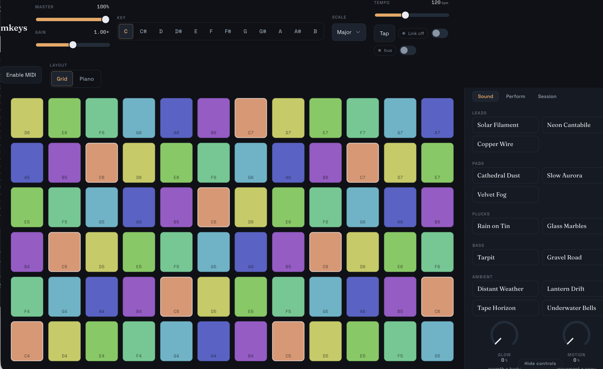

<div align="center">

# mkeys

**Touch a note. Bend into the next. Never leave the scale.**


[](./package.json)
[](./LICENSE)
[](#verification)
[](./tsconfig.json)
[](https://react.dev)
[](https://vite.dev)
[](https://developer.mozilla.org/docs/Web/API/AudioWorklet)
[](#progressive-web-app)

### [▶ Play it live in your browser → mkeys.mpump.live](https://mkeys.mpump.live)



</div>

---

`mkeys` is a browser-native, expression-first **lead & melody** instrument. Its primary object is the **gesture** — not a piano keyboard. Play a scale-locked ribbon/grid surface where every cell is a scale degree, so you literally can't play a wrong note; slide horizontally to bend between degrees (with 0–100% quantize), move vertically for timbre, and press for dynamics. An AudioWorklet synth turns each touch into sound, and the voiced notes go out to MIDI gear, a DAW, or a companion instrument. It's local-first and offline-capable: no account, no cookies, no telemetry, and no audio ever leaves the page.

## Highlights

- **Scale-locked surface** — a ribbon/grid where every cell is a degree of the current scale. You can't hit a wrong note; you only choose *which right note* and how you arrive at it.
- **Per-touch expression** — each finger is an independent voice with three continuous axes: **horizontal glide** between degrees (quantize 0–100%, from stepped to fully portamento), **vertical timbre**, and **pressure** dynamics.
- **8-voice polyphony** — up to eight simultaneous touches, each tracked as its own voice with clean note-offs and no hung notes.
- **AudioWorklet synth** — a hand-written voice on the audio thread: 2 oscillators + sub + noise, a resonant filter, two envelopes (amp + filter), an LFO, unison, and glide. DSP runs off the main thread for stable, low-jitter sound.
- **14 factory presets** across five families — leads (Solar Filament, Neon Cantabile, Copper Wire), pads (Cathedral Dust, Slow Aurora, Velvet Fog), plucks (Rain on Tin, Glass Marbles), bass (Tarpit, Gravel Road), and ambient (Distant Weather, Lantern Drift, Tape Horizon, Underwater Bells).
- **Microtuning & scales** — play any tuning, not just 12-TET: from the **Perform** panel pick a built-in scale (just intonation, meantone, maqam, gamelan, 19/22/31-EDO…), set the tonic reference pitch, or import a Scala **`.scl`** scale and **`.kbm`** keyboard map. Arbitrary note counts and non-octave periods (e.g. Bohlen-Pierce) are supported; the resolved per-note frequency crosses to the audio worklet, so retuning is exact and 12-TET stays the click-identical default. A MIDI controller reaches the full scale under a tuning too — incoming notes follow the active tuning (or its `.kbm` keyboard map when loaded), not a fixed diatonic layout. The tuning core is vendored verbatim from **[mdrone](https://mdrone.mpump.live)** (`npm run vendored:check`; see [`NOTICE`](./NOTICE)).
- **Four performance macros** — **Glow · Motion · Air · Grit** — each sweeps a curated group of synth and FX parameters for fast, musical shaping.
- **Performance tools** — arpeggiator, chord mode, latch, and a phrase recorder for building up and looping ideas hands-free.
- **FX tail** — a shared master chain: drive, chorus, tempo-syncable delay, reverb, and a master limiter. Click-free, no runaway peaks.
- **Optional MIDI in + out** — receive from a controller and send the *actual played notes* with correct note-ownership and note-offs. Enable **MPE** on output to carry microtuned pitches to external gear: each voice takes its own member channel with a per-note pitch bend (receiver bend range ±48 semitones), so a chord's notes bend independently instead of rounding to 12-TET. Never required.
- **Optional Ableton Link** — tempo-follow via the companion **mpump** link-bridge; degrades gracefully when it's absent. Link takes tempo **only when you enable it** *and* the bridge is connected — a background auto-detect discovers availability without seizing tempo, and disabling Link instantly restores your stored local BPM.
- **Optional mbus publish** — the “bus” toggle next to Link offers the master output to the [mbus](https://mbus.mpump.live) patchbay as a source named `mkeys` (tab-to-tab WebRTC via the same link-bridge, peer-to-peer, no server). Off by default; harmless without the bridge.
- **Sessions, JSON & share links** — the working session autosaves; named sessions use local persistence (IndexedDB), readable JSON import/export, and self-contained share links — no backend.
- **Master WAV capture** — record the master bus straight to a `.wav` file, entirely in the browser.
- **Installable PWA** — offline after one visit, local-first, no account.

## Run locally

```bash
npm install
npm run dev
```

Open the URL Vite prints — audio starts on your first interaction (touching the surface or pressing a key), per browser autoplay policy.

## Scripts

| Script | Purpose |
| --- | --- |
| `npm run dev` | Vite dev server with HMR |
| `npm run build` | Type-check (`tsc -b`) and production build |
| `npm run preview` | Serve the production build locally |
| `npm run lint` | ESLint |
| `npm run test` | Vitest (run once) |
| `npm run test:watch` | Vitest in watch mode |
| `npm run typecheck` | Type-check without emit |
| `npm run vendored:check` | Verify the vendored tuning core matches `../mdrone/src/tuning` |
| `npm run vendored:sync` | Refresh the vendored tuning core from `../mdrone` |
| `npm run check` | **vendored:check + typecheck + lint + test + build** (the full gate) |

## Keyboard

Two QWERTY rows map onto the first two rows of the surface, so you can play without a pointer or MIDI controller. Auto-repeat is suppressed (a held key sounds once), keystrokes are ignored while a text field is focused, and losing window focus releases every note so none hang.

| Keys | Surface | Notes |
| --- | --- | --- |
| `a s d f g h j k l ;` | row 0 (lower), columns 0–9 | ten degrees of the lower octave |
| `q w e r t y u i o p` | row 1 (higher), columns 0–9 | ten degrees of the higher octave |

Keyboard presses use a fixed neutral expression (no glide, mid timbre, firm pressure) — the continuous axes are reserved for touch and pointer input.

## Performance controls

- **Panic / All-Notes-Off** — an always-visible **Panic** button on the transport strip (reachable with controls shown or hidden), also bound to **`Esc`**. `Esc` is never a musical-typing key and is ignored inside text fields, so it can't fire mid-word. Panic silences every synth voice, MIDI-out note, MPE allocation, pitch-bend and sustain state, and latch-held notes, **and stops the arpeggiator and phrase playback** (their modes stay armed — play again to resume).
- **Sustain vs. latch** — these are separate. **Latch** (Perform panel) is a performance toggle that keeps played notes sounding after release. **Sustain** is the MIDI pedal (CC64): while it's down, note-offs are deferred and released when the pedal lifts — for keys no longer held; keys still down keep sounding. Re-striking a sustained note retriggers it. The pedal never flips the on-screen Latch toggle.
- **Stored tempo** — the local BPM is saved with the session, so a phrase recorded at one tempo reloads and shares at that tempo. Sessions and share links created before this default to 120 BPM. Ableton Link may drive the *effective* tempo while enabled, but never overwrites your saved local BPM.
- **Glide quantize** — a **Glide quantize** slider in the Perform panel (Playing surface) sets how a slide moves between degrees: **0% = continuous** portamento, **100% = stepped/snap**. Applied live. The same panel's *Advanced layout* exposes rows, columns and the isomorphic row offset.
- **Master WAV capture** — records the master bus to a `.wav`. Capture holds the take in memory, so it's bounded to a documented ceiling (**5 minutes**); the Session panel shows elapsed / capacity while recording, and capture auto-stops and finalises at the limit. A take that captured no audio is never downloaded as an empty file.
- **Chord modes** — Off · Fifth · Octave · Triad. (An earlier redundant "Unison" mode — identical to Off, since thickening is the patch's own unison voices — was retired; old sessions/links that used it load as Off.)

## Accessibility

The control drawer is a proper WAI-ARIA **tablist**: Sound / Perform / Session tabs carry `role="tab"` with `aria-controls`/`aria-selected`, panels are `role="tabpanel"` labelled by their tab, hidden panels are removed from assistive tech and the tab order, and the tabs are keyboard-operable with **Left/Right** and **Home/End** (roving tabindex). Status and error messages use live regions (`role="status"` / `role="alert"`), and the surface's musical typing rows never capture keys while a text field is focused.

## Latency & live use

Audio in the browser has an unavoidable round-trip delay — the hardware output buffer plus the `AudioContext`'s `baseLatency` and `outputLatency` — **typically ~10–30 ms**. That's a platform floor no web app can beat, so mkeys opens its context with `latencyHint: 'interactive'` (smallest safe buffer) and **reports the measured figure** in **Session → Output latency** rather than implying it's zero.

Where mkeys shines: **loop- and production-oriented playing**, sound design, and **performing *into* the app** — touch / keyboard / MIDI → synth → WAV capture or MIDI out. For all of those the round-trip sits comfortably inside a good feel.

What it can't do: **sub-5 ms live monitoring of an external instrument**. If you're monitoring a live source (say a controller feeding a hardware synth alongside mkeys), route the **dry** signal through your interface's **direct / hardware monitoring** for zero-latency feel and let mkeys add the **wet** processed layer on top.

## Architecture

```text
pure & framework-free                 React boundary                 audio thread
─────────────────────                 ──────────────                 ────────────
harmony/  (scales, degrees) ────┐
surface/  (geometry, glide) ────┤
                                ├─▶ app/ store + useInstrument ─┐
transport/ arp ─────────────────┘                             │
                                                  ┌─ NoteSink ◀─┤
transport/ Scheduler (lookahead,  ◀── sample ─────┤            │
  "two clocks", React-independent)      clock     ├─▶ audio/ engine ─▶ synth.worklet
                                                  │    (AudioWorklet voice pool
                                                  │     → fx → limiter → recorder)
                                                  └─▶ midi/ emit (played notes)
```

- **The core is pure** — `harmony/` (scales, degrees), `surface/` (geometry, glide), and the `transport/` scheduler carry no React, no Web Audio, and no DOM. They're fully deterministic and exhaustively tested.
- **Two clocks.** A lookahead scheduler plans each event against the `AudioContext` clock and dispatches it a short window ahead from the main thread (the "two clocks" pattern); the `synth.worklet` then renders DSP sample-accurately on the audio render thread. Neither depends on React frames. Note *dispatch* is main-thread `setTimeout`, so onsets are tight but best-effort, not sample-locked — heavy UI load or tab throttling can still add jitter.
- **One `NoteSink` contract** is implemented by both the audio engine and MIDI out, so the same played notes reach both at the same dispatch time.
- **Validation at every boundary** — IndexedDB sessions, share URLs, and MIDI all pass untrusted data through a total sanitizer before it reaches the engine.

## Verification

```bash
npm run check   # vendored:check + typecheck + lint + full test suite + production build
```

Tests are deterministic and live next to the code (scales & degrees, surface geometry, glide/quantize math, arp, scheduler planning, MIDI bytes + note ownership, persistence, share round-trips, keyboard map). Vitest runs in a Node environment, so **touch-feel and audio quality are covered by a manual physical-device QA checklist** (phone + tablet + desktop), not unit tests:

- [ ] Multi-touch polyphony — up to 8 fingers, each an independent voice
- [ ] Glide / timbre / pressure — all three axes respond smoothly per touch
- [ ] No hung notes — lifting, dragging off-surface, and losing focus all release cleanly
- [ ] MIDI in + out — controller input plays; played notes emit with correct offs; MPE out plays a microtuning in tune on external gear (bend range ±48)
- [ ] Ableton Link — tempo-follow tracks the bridge, degrades gracefully without it
- [ ] PWA — installs, and works offline after the first visit
- [ ] WAV export — master capture produces a clean, click-free file

## Privacy

Everything is local. No account, no cookies, no telemetry, no fingerprinting. The working session and named saved sessions live in your browser's **IndexedDB**; share links carry the scene in the URL fragment and never hit a server. No audio or MIDI data is sent anywhere.

## Browser notes & limitations

- Audio starts on the first user gesture (touching the surface or pressing a key), per browser autoplay policy.
- The engine uses the real `AudioContext.sampleRate` and never assumes 44.1/48 kHz.
- **Web MIDI** is requested only when you enable it, and is optional (Chromium-family browsers).
- **Pressure** dynamics need supporting hardware (a pressure-sensitive touchscreen or stylus); without it, touches use a firm default and the other axes still work.
- **Ableton Link** needs the companion **mpump** link-bridge running locally (`ws://localhost:19876`); without it the Link panel simply stays offline.
- **mbus publish** rides the same link-bridge; without it the “bus” toggle just keeps retrying quietly and nothing is published. Audio flows tab-to-tab over WebRTC and never leaves the machine.
- A PWA install does not provide background or lock-screen audio.

## Repository map

```text
src/
  types.ts            shared contracts — every cross-module type lives here
  App.tsx             UI composition + global keyboard
  main.tsx            entry, service-worker registration, font imports
  harmony/            pure scale/degree theory (scales · tuning resolver)
  vendor/             tuning-core/ vendored verbatim from mdrone (see NOTICE)
  surface/            pure surface geometry + glide math (geometry · glide)
  transport/          lookahead scheduler + arp + Ableton Link adapter
    arp · scheduler · clock · linkBridge · linkClock
    mbus/             vendored mbus-client (patchbay publish; see NOTICE)
  audio/              AudioWorklet synth engine
    engine · fx · macros · presets · recorder · index
    worklets/         synth.worklet · recorder.worklet · silence.worklet
  midi/               optional Web MIDI (parse · emit · ownership)
  persistence/        IndexedDB sessions + migrations (session · db)
  sharing/            backend-free share-link codec
  app/                useInstrument bridge · store · useKeyboardPlay
  components/         Surface/ hero, TransportBar, PatchPanel, Macros,
                      PresetPicker, PerformancePanel, SessionBar, ui/ kit
  styles/             theme tokens + global CSS
public/               manifest, service worker, icon, CNAME
.github/workflows/    CI + GitHub Pages deploy
```

## Progressive Web App

`public/manifest.webmanifest` + `public/sw.js` make `mkeys` installable. The hand-rolled service worker precaches the app shell and hashed assets, so the full instrument works offline after a single successful load. Install it to your home screen or desktop and it launches like a native app — local-first, no network required.

## Deployment

Pushes to `main` are deployed by GitHub Actions (`.github/workflows/ci.yml` runs the full `npm run check` gate; `.github/workflows/deploy.yml` builds and publishes `dist/` to GitHub Pages), served at the custom domain **[mkeys.mpump.live](https://mkeys.mpump.live)**. It's a root-domain deploy, so the build is root-relative (`base: '/'`) and `public/CNAME` pins the domain across deploys (no `gh-pages` branch).

One-time setup:

- **Settings → Pages → Source** → **GitHub Actions**
- add DNS: `CNAME  mkeys → <owner>.github.io` (per your DNS provider)

## Family

mkeys is part of the **mpump** family of browser-native instruments — [mpump](https://mpump.live), [mchord](https://mchord.mpump.live), [mdrone](https://mdrone.mpump.live), [mgrains](https://mgrains.mpump.live), [mspectr](https://mspectr.mpump.live), [mscope](https://mscope.mpump.live), [mloop](https://mloop.mpump.live), [mvox](https://mvox.mpump.live), [mfx](https://mfx.mpump.live), [mtape](https://mtape.mpump.live), and mkeys — all at `*.mpump.live`. mkeys is the **lead / melody** instrument, sitting between [mchord](https://mchord.mpump.live) (harmony) and [mpump](https://mpump.live) (patterns). Reused code is credited in [`NOTICE`](./NOTICE).

## License

[GNU Affero General Public License v3.0 or later](./LICENSE) — see [`LICENSE`](./LICENSE) and [`NOTICE`](./NOTICE).
